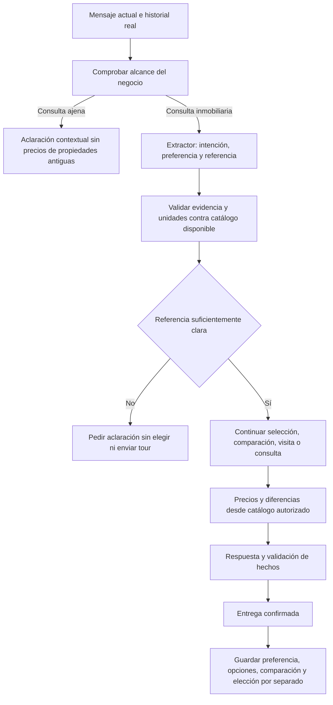

# Correcciones de continuidad de la automatización — 22 de septiembre de 2026

Esta entrega corrige las preferencias mal interpretadas, las referencias a unidades, las comparaciones que se perdían entre mensajes y la continuación de preguntas ajenas al proyecto. Integra las correcciones locales anteriores de alcance. Las reglas se ejecutan en la ruta compartida de la automatización y conservan la política comercial de precios; no dependen de un estilo de redacción.

Los cambios quedan locales. No se realizó commit, push, despliegue, activación de leads, modificación de configuración de producción ni envío de mensajes reales. No hay una migración nueva: la memoria utiliza el JSON de `conversations.summary` que ya existe.

## Qué estaba pasando

El flujo tenía decisiones independientes: el extractor interpretaba el mensaje, expresiones regulares elegían categorías/unidades y distintas capas redactaban o revisaban la respuesta. La referencia almacenada mezclaba opciones ofrecidas y opciones elegidas. Una preferencia antigua podía ganar a la lista que el cliente acababa de leer; una comparación de dos unidades podía convertirse en el rango completo de departamentos.

Estos son defectos comprobados en el código y reproducidos con pruebas. Las capturas por sí solas no revelan la salida histórica exacta del extractor en producción. Esta entrega incorpora trazas para distinguir la interpretación, la resolución y la ruta efectiva en las próximas conversaciones.

## Flujo después de la corrección

La memoria nueva `_property_context` separa:

| Dato | Significado |
|---|---|
| `preference_category` | Categoría que el cliente expresó como preferida. |
| `excluded_categories` | Categorías descartadas en la interpretación actual. |
| `offered_ids` | Opciones que realmente aparecieron en la respuesta entregada. |
| `comparison_ids` | Unidades que se están comparando. |
| `selected_ids` | Unidad identificada por el cliente o confirmada al elegir una opción. |
| `phase` y `journey` | Paso de la selección residencial; no altera la etapa comercial del CRM. |
| `last_reply` | Respuesta efectivamente entregada, usada para detectar cambios respecto de la memoria. |

El historial aclara expresiones como «sí», «el más grande» o «¿y en precio?». El catálogo sigue siendo la autoridad para superficies, clasificación, disponibilidad y precios. Un número de unidad no concede permiso para mostrar un precio oculto por la política comercial.

## Reglas corregidas

1. **Preferencia frente a objeción.** «Me interesan los departamentos porque los penthouses son caros» elige departamentos. La mención de penthouses como objeción no cambia la preferencia ni declara un presupuesto.
2. **Criterio del extractor.** Se añadieron categoría, categorías descartadas, tipo de referencia, códigos y selector relativo al mismo extractor. Las decisiones con evidencia y confianza alta llegan a la ruta comercial, a la revisión y a la memoria. Si no hay una interpretación válida, se usa una lectura literal conservadora.
3. **Referencias relativas.** «El más grande» usa la última lista mostrada y superficie interior verificada. No vuelve a una categoría vieja. Empates, áreas desconocidas o unidades retiradas requieren aclaración. «El primero» conserva el orden presentado.
4. **Negaciones.** «No quiero el más grande» y «el 202 no me interesa» no registran una elección ni disparan su tour.
5. **Comparaciones.** «202 y 302» conserva el conjunto. «¿Y en precio?» muestra los dos precios y la diferencia calculada en centavos. No usa un rango general como sustituto.
6. **Nuevas opciones.** Una lista distinta reemplaza las referencias anteriores; no queda una comparación antigua activa por debajo.
7. **Códigos y categorías.** «Departamento 602» puede identificar la unidad aunque el catálogo diga penthouse. La respuesta usa la categoría real. Se reconocen códigos con ceros iniciales y locales con prefijo. Un código inexistente no recupera una unidad vieja.
8. **Elección antes del tour.** Al listar opciones se pregunta cuál desea conocer. Si queda una sola, se ofrece para confirmar; no se elige por el cliente. Un «sí» puede confirmar esa opción única, pero no elegir entre varias. Tras una elección clara se conserva `/tour?unidad=NNN`; una solicitud general usa `/tour`.
9. **Solicitudes visuales.** «Referencia interactiva» se reconoce como solicitud de recorrido. Una foto de la fachada se refiere al proyecto y no recupera el interior de un departamento guardado.
10. **Requisitos concretos.** Una pregunta de dormitorios, jardín, precio, brochure o cita no queda interceptada por la respuesta genérica de selección de categoría. Las alternativas solo mencionan categorías disponibles. Un requisito indispensable repetido no provoca la misma oferta de alternativas otra vez.
11. **Temas ajenos.** Después de una consulta sobre alimentos, viajes u otro servicio, una pregunta ambigua de precio conserva ese referente y aclara el límite. El cliente puede volver explícitamente a las propiedades. El texto se adapta al tema; «papas» no es una plantilla universal.
12. **Respuesta final.** Una cotización simple verificada conserva sus cifras y comparación. Las preguntas adicionales siguen pasando por la revisión de cobertura; no se oculta una consulta sin respuesta detrás de un precio. Quitar una negativa obsoleta tampoco deja la respuesta vacía si falla el revisor.

## Ejemplos de antes y después

Son ejemplos con los datos de las capturas y de las pruebas, no una nueva certificación del inventario de producción. La redacción puede variar según el estilo; las cifras y la decisión deben conservarse.

| Mensaje o situación | Antes | Después esperado |
|---|---|---|
| «Me interesan más los departamentos porque los penthouses deben ser muy caros». | Lista de penthouses 602, 605, 606 y 603. | «Tenemos departamentos de tres dormitorios en las plantas disponibles del catálogo. ¿Qué planta prefiere?» En el catálogo de prueba: segunda y tercera planta. No vuelve a preguntar dormitorios ni menciona penthouses como elección. |
| Después de mostrar 602 y 605: «Me interesa el más grande». | Cambiaba a departamentos 202/302/402/502. | «El penthouse 602 tiene 3 dormitorios y 142,09 m² interiores, en la sexta planta alta. Puede conocerlo en el recorrido: https://www.lavilett.com/tour?unidad=602». Continúa con el siguiente dato que falte. |
| Después de comparar 202 y 302: «¿Y en precio?». | «Las opciones van de USD 210.000 a USD 310.000». | «El departamento 202 tiene un valor de USD 250.000 y el 302 de USD 270.000. La diferencia es de USD 20.000». En lanzamiento añade el carácter referencial si la política permite publicar precios. |
| El bot presenta varias opciones. | «¿Cuál desea explorar en 360?». | «¿Cuál de estas opciones le gustaría conocer?». |
| Dos departamentos empatan en superficie: «El más grande». | Riesgo de seleccionar cualquiera. | «Hay varias opciones que encajan: departamento 202 y departamento 302. ¿Cuál de estas opciones le gustaría conocer?». |
| «No quiero el departamento 202». | Podía guardar 202 por la mera mención del número. | Descarta esa selección. No envía el tour del 202. |
| Solo se ofrece una unidad y el cliente responde «sí, por favor». | La opción se elegía antes de responder, o la continuación podía perderse. | Registra la elección al recibir la aceptación y presenta el tour de esa unidad. |
| «Quiero una vivienda de cinco dormitorios». | Recomendación inmediata de un penthouse costoso. | Explica que esa cantidad no está disponible y pide permiso para comparar las alternativas más amplias realmente disponibles, antes de elegir una unidad. |
| «Quiero papas» → aclaración → «¿Qué precio tiene?». | Podía cotizar una propiedad anterior. | «Si se refiere al precio de las papas, como le indiqué, lamentablemente no gestionamos la venta de alimentos. Sin embargo, si desea conocer los precios de La Vilet, le comento que contamos con suites, departamentos y locales comerciales. Si su consulta es sobre alguna de estas opciones, indíqueme cuál le interesa y con gusto le comparto los precios disponibles». |

## Archivos: antes y después

Rutas de los módulos bajo `src/lib/integrations/automation/`:

| Archivo | Antes | Después |
|---|---|---|
| `turn-semantics.ts` | Semántica de intención, presupuesto y respuesta a pregunta pendiente. | Añade la interpretación de propiedades con evidencia; reconoce preguntas sobre departamentos/penthouses y «conocer» una opción. |
| `property-context.ts` — nuevo | Sin módulo que separara todas estas referencias. | Resuelve, valida y persiste preferencias, opciones ofrecidas, comparaciones y elecciones; gestiona negaciones, empates y referencias incompletas. |
| `catalog-reference.ts` | Algunos pares de códigos sin repetir «departamento» quedaban fuera. | Amplía referencias a penthouse, locales y comparaciones; expone códigos solicitados y reconoce fachada como tema del proyecto. |
| `conversation.ts` | Referencia calculada antes del extractor; contexto perdido en algunas revisiones. | Resuelve después de la semántica, conserva el contexto en revisión y memoria, registra razones de resolución y evita persistir unidades ambiguas. |
| `sdr.ts` | Varias rutas podían decidir con referencias distintas. | Consume el contexto común, prioriza aclaraciones, distingue ofrecido/elegido y registra la comparación de precios. |
| `unit-alternatives.ts` | Categoría por palabras y elección implícita de la única unidad. | Preferencia semántica, opciones disponibles, pregunta de elección y confirmación antes del tour. |
| `property-selection.ts` | Categorías limitadas y algunas menciones/consultas tratadas como elección. | Incluye penthouse, objeciones y referencias relativas; conserva requisitos físicos y rutas de precio, brochure o cita. |
| `price-reply.ts` | Podía volver a categoría antigua/rango general y elegir la alternativa barata tras una aceptación. | Respeta referencia actual, compara precios autorizados, calcula diferencia y no elige entre varias por un simple «sí». |
| `response-plan.ts` | Protección sin distinguir la nueva aclaración ni cotización simple verificada. | Protege esas respuestas; mantiene revisión de consultas adicionales. |
| `business-scope.ts` | Continuación ambigua dependía demasiado de la etiqueta del clasificador y del último renglón del historial. | Protege el referente externo incluso con mensajes consecutivos o etiquetas contradictorias; admite regreso explícito al proyecto. |
| `sales-subject.ts` | Una pregunta de precio sola podía aceptar la redirección a inmuebles. | Distingue pregunta de precio y aceptación; no confunde limitaciones inmobiliarias con otro negocio. |
| `unit-visual-request.ts` | «Referencia interactiva» no se reconocía. | Se reconoce junto con las demás solicitudes visuales. |
| `turn-completeness.ts` | Si se quitaba una negativa obsoleta y quedaba vacío, no se intentaba reparar. | Revisa la consulta con sus hechos y tiene una aclaración de respaldo sin inventar un traspaso. |

Pruebas y comando reproducible:

| Archivo | Cambio |
|---|---|
| `scripts/property-context.test.cjs` — nuevo | Continuidad, evidencia, comparaciones, negaciones, disponibilidad, ceros iniciales, orden y confirmación única. |
| `scripts/property-journey-regression.test.cjs` — nuevo | Preferencias, objeciones, etapas de selección y opciones ofrecidas/elegidas. |
| `scripts/comparison-price.test.cjs` — nuevo | Precios autorizados, diferencias, referencias nuevas, precios ocultos y aceptación ambigua. |
| `scripts/integrations.test.cjs` | Recorrido completo: extracción, declaración, respuesta enviada y persistencia; estilos `actual`, `cercano`, `equilibrado`, `elegante`. También actualiza mocks y expectativas antiguas del tour, traspaso y guardado de mensajes. |
| `scripts/business-scope.test.cjs` | Alcance y preguntas ambiguas sobre productos ajenos, con conversaciones consecutivas. |
| `scripts/unit-alternatives.test.cjs` | Requisitos físicos, alternativas disponibles y negativas reiteradas; sustituye expectativas antiguas de recomendar automáticamente la unidad costosa. |
| `scripts/turn-completeness.test.cjs` | Aclaración de respaldo cuando el revisor falla después de quitar una negativa obsoleta. |
| `src/lib/integrations/automation/unit-tour-link.test.ts` | Comprueba elección antes del recorrido, incluidos casos con una sola opción. |
| `package.json` | Añade `npm run test:conversation` para repetir la batería de continuidad. |

El archivo adjunto `AUTOMATIZACION_2026-09-22.patch` contiene la comparación exacta contra `HEAD` al finalizar esta entrega, incluidos los módulos y pruebas nuevos. No es necesario aplicarlo sobre este mismo directorio: los cambios ya están en los archivos. Incluye las correcciones locales de alcance que estaban pendientes al empezar.

## Verificación y límites

La verificación usa catálogos de prueba y servicios simulados; no envía WhatsApp, no crea leads reales y no aplica migraciones de prueba. Los casos de fechas usan bases aisladas.

- Automatización: `npm run test:automation`: **94/94**.
- Flujo completo: `npm run test:integrations`: **201/201**.
- Continuidad y regresiones: `npm run test:conversation`: **98/98**.
- Total de estas tres suites: **393 pruebas aprobadas, cero fallos**.
- Tipos: `tsc --noEmit`: aprobado; también aprobado durante el build final.
- ESLint dirigido a los módulos modificados, pruebas nuevas y pruebas de continuidad: aprobado.
- Compilación de producción: `npm run build`: aprobada; **59 páginas generadas**.
- Diff exacto: verificado con `git apply --reverse --check` (solo comprobación; no se aplicó ni se revirtió).

Las pruebas comprueban decisiones y datos con interpretación simulada: no garantizan que un proveedor de IA interprete todas las frases futuras correctamente ni verifican la latencia de entrega de Kommo. Si no hay una referencia fiable, la protección incorporada es pedir una aclaración antes de elegir una unidad. El despliegue de estos archivos es un paso separado; no cambia automáticamente la restricción operativa al lead de Carlos.
