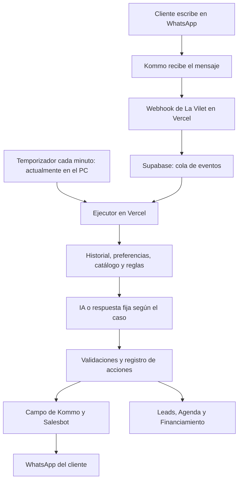

# Flujo actual de automatización de La Vilet

**Actualización posterior:** el disparador se trasladó a Supabase Cron y el proceso local fue detenido. Los hallazgos sobre dependencia del PC que siguen abajo describen el estado previo a ese cambio. Operación actual y verificaciones en [Ejecutor en la nube](EJECUTOR_EN_NUBE.md).

Revisión de código y consultas de lectura a Supabase: 9 de septiembre de 2026, 22:39, hora de Ecuador (10 de septiembre, 03:39 UTC). Código local: commit `4382551`, sin modificaciones previas a este documento. Esta revisión no ejecutó el motor, envió mensajes, cambió configuraciones ni modificó datos. No se comprobó que Vercel esté ejecutando exactamente ese commit.

## Estado observado

- El motor registraba mantenimiento completado cada minuto; el último registro consultado terminó a las 03:39:30 UTC.
- La cola técnica del proyecto contenía 3 eventos entrantes completados y 5 cancelados. No había eventos entrantes pendientes, en procesamiento o inciertos en esa consulta. Son registros actualmente conservados, no el total histórico de WhatsApp.
- La bandeja de envíos de citas contenía una propuesta con estado `accepted`. Ese estado significa que Kommo aceptó iniciar el Salesbot; no confirma entrega al teléfono.
- `lv_auto_config`: habilitado, sin simulación, sin limitarse al lead de prueba.
- La configuración comercial estaba en modo `lanzamiento`.
- El temporizador observado es `scripts/automation-cron.mjs --watch`, ejecutado en el PC. No hay `vercel.json` que programe el cron ni extensiones `pg_cron`/`pg_net` instaladas en la base consultada.
- La última evaluación documentada con la clave local de OpenAI se interrumpió por `credit_balance_exhausted`. Esta revisión no hizo nuevas llamadas facturables ni comparó esa clave con la de Vercel; no demuestra el saldo actual de producción.

## Recorrido de una conversación

1. **Recepción.** Kommo llama a `/api/integrations/kommo/webhook`. El servidor valida la clave, la cuenta de Kommo, el formato y la activación. Solo incorpora mensajes entrantes externos de WhatsApp vinculados a leads. Ignora mensajes anteriores a la fecha de activación y mensajes salientes.
2. **Cola persistente.** Guarda el evento en `lv_integration_events`, con una clave que evita registrar dos veces el mismo evento. Devuelve la confirmación del webhook después de guardar; todavía no genera una respuesta comercial.
3. **Espera y agrupación.** Hay una espera de 30 segundos y se evita tomar una conversación mientras llegan mensajes recientes de ese contacto. El temporizador invoca `/api/integrations/automation/run` cada minuto. En condiciones ideales, la primera selección puede ocurrir aproximadamente entre 30 y 90 segundos después de recibir el mensaje; después se suma el procesamiento. Es una estimación de la programación, no un promedio medido ni un compromiso de respuesta.
4. **Registro del lead.** Verifica en Kommo que el contacto pertenece al lead y obtiene su teléfono. Registra la conversación y los mensajes mediante funciones existentes de Supabase, conservando la fecha original y el identificador externo. Un mensaje duplicado no se responde otra vez.
5. **Controles iniciales.** Comprueba configuración, alcance del proyecto, modo de prueba, habilitación del bot y `STOP_IA` de Kommo. Si el bot está pausado, el mensaje puede quedar registrado sin respuesta; reactivar el bot no equivale a reproducir automáticamente todos esos mensajes.
6. **Contexto.** Consulta los últimos 12 mensajes pertinentes, el resumen guardado, las preferencias y las propuestas de visita. Los datos comerciales proceden del proyecto, unidades publicadas disponibles, amenidades y puntos de interés.
7. **Respuesta según el caso.** Un primer saludo breve usa la bienvenida guardada, sin llamar al modelo. La conversación comercial normalmente genera resumen, extrae eventos, redacta y revisa: son varias llamadas a IA. Las propuestas pendientes tienen su propia clasificación de intención. Un archivo que no pueda interpretarse genera una petición de aclaración.
8. **Actualización de información.** Registra preferencias expresas, señales comerciales, puntuación y cambios de temperatura/etapa. La actividad del negocio, área, prioridad, plazo y presupuesto textual se conservan en `leads.behavior_signals.sdr`. Cambiar entre vivienda y local descarta datos de búsqueda incompatibles.
9. **Revalidación antes de enviar.** Vuelve a comprobar pausa, baja, identidad del destinatario, antigüedad del mensaje, nueva entrada del cliente y envíos de citas sin resolver. Si entra otro mensaje durante la redacción, cancela esa respuesta para evitar contestar algo desactualizado.
10. **Salida.** Escribe el texto en el campo de Kommo `457014`, inicia el Salesbot `15578` y registra la respuesta y el resumen en Supabase. La aplicación no envía directamente al proveedor de WhatsApp: conserva Kommo y sus Salesbots como canal de salida.

El ejecutor usa un bloqueo por proyecto para evitar dos ejecuciones concurrentes propias. Procesa hasta tres lotes, sujeto a un presupuesto de tiempo, y después hasta diez avisos de citas. No existe una prueba de carga que permita prometer la misma demora con muchos leads simultáneos.

## Qué controla la forma de hablar

La interfaz está en **Inmobiliaria → Automatización → Guion → Cómo responde**. Los cambios guardados en los prompts activos se leen en mensajes posteriores.

| Control | Efecto actual |
| --- | --- |
| `saludo_inicial` | Bienvenida literal del primer saludo breve. |
| `respuesta_comercial` | Tono, orientación, ejemplos y preguntas de descubrimiento. |
| `resumen_conversacion` | Memoria y continuidad de la conversación. |
| `extractor_eventos` | Preferencias e intenciones que pueden activar acciones. |
| `revisor_respuesta` | Revisa la redacción y puede pedir una reescritura. |
| Código y funciones SQL | Pausas, validación de citas, puntuación, financiamiento, límites y efectos reales. |
| Catálogo y configuración del proyecto | Hechos, unidades y modo comercial que la IA puede utilizar. |

El objetivo configurado es responder primero la consulta y después hacer una pregunta útil, sin emojis, identidad inventada de asesor ni saludos repetidos. No obliga a completar todas las preguntas antes de coordinar una visita. El revisor y las comprobaciones reducen errores, pero no prueban que una IA nunca producirá una frase inadecuada.

**Editar el prompt comercial no cambia todos los mensajes.** Las preguntas de identificación e ingresos de financiamiento, algunos avisos de derivación y coordinación, y los textos de propuesta/confirmación/recordatorio están definidos en código. Las plantillas antiguas de referencia o un tema nuevo en Guion tampoco se convierten automáticamente en una ruta ejecutada.

En modo lanzamiento el contexto comercial oculta precios. En preventa solo admite precios publicados de unidades pertinentes. En la revisión del catálogo no había precios comerciales publicados; el bot no debe inventar el rango del ejemplo del usuario.

## Visita, propuesta y confirmación

1. El cliente pide una visita. Si no indica preferencia, se pregunta día y horario.
2. Al dar la preferencia, se crea una solicitud en `appointments` y `appointment_reschedule_requests` mediante funciones que evitan repetir la solicitud del mismo mensaje.
3. La preferencia se guarda como texto; esta ruta no convierte por sí sola el mensaje en un horario confirmado. La Agenda recibe el pendiente y se aplica la asignación de asesor correspondiente.
4. El asesor revisa y establece/acepta una propuesta concreta. El sistema crea un envío pendiente en `lv_outbox`.
5. El ejecutor valida la vigencia, el asesor, el horario y la ruta antes de iniciar el Salesbot de propuesta.
6. El cliente acepta o solicita otro horario. Aceptar exige una propuesta enviada y vigente y una respuesta inequívoca vinculada a ella. Un saludo, una pregunta de precio o una duda no deben confirmar una cita.
7. La función de confirmación vuelve a verificar aceptación del asesor y del cliente, disponibilidad, horario laboral y ausencia de cruces. Actualiza la cita y encola la confirmación; la IA no puede sustituir ese proceso diciendo «agendado».
8. Una cita confirmada puede generar el recordatorio de dos horas. Si cambia o se cancela, se anulan recordatorios pendientes de la versión anterior.

Hay límites concretos: el planificador exige detectar la versión de la cita con más de dos horas y media de anticipación para crear ese recordatorio. El envío dispone de una ventana de 30 minutos y el código exige un mensaje reciente del cliente de menos de 24 horas. Por ello, una cita cercana, una interrupción prolongada o una conversación antigua pueden quedarse sin recordatorio. No está implementada una ruta alternativa con plantillas para conversaciones fuera de esa ventana.

Los avisos de propuesta usan el Salesbot `18724`; confirmación y reprogramación, `18730`; recordatorio, `18350`. Los campos y rutas se validan antes de usar esos bots. Las citas creadas manualmente no necesariamente recorren todos los pasos de confirmación de una solicitud originada por el bot.

## Atención humana, financiamiento y tareas periódicas

**Atención humana.** Una petición explícita de asesor/llamada o la finalización de la recopilación financiera ejecuta `handoff_lead`. En horario laboral intenta asignar un asesor habilitado; fuera de horario deja la solicitud en cola. Guarda la asignación y el escalamiento en Supabase, pausa el bot y establece `STOP_IA` en Kommo. No agenda automáticamente una llamada con hora confirmada.

La asignación al asesor se realiza en el sistema. Esta integración no actualiza automáticamente el responsable, pipeline ni etapa de Kommo. Si el horario está abierto pero no hay asesor elegible, la función de derivación puede fallar; no todos esos casos pasan a una cola automáticamente.

**Financiamiento.** Al identificar interés y consentimiento, el proceso solicita la entidad y los datos requeridos según su estado. Conserva el avance en `financing_prequalifications`; al completar lo necesario crea una entrada en `asesoria_financiamiento` y deriva para revisión. No aprueba créditos ni genera automáticamente una venta, contrato o simulación en `lead_financing`.

**Tareas periódicas.** El ejecutor planifica avisos de visitas. Liberar reservas de horario vencidas, escalar solicitudes sin respuesta, atender la cola de derivaciones y reducir temperatura por inactividad requieren además `AUTOMATION_GLOBAL_MAINTENANCE=true`, sin restricciones de prueba. No se verificó ese valor en el despliegue de Vercel. Un registro de mantenimiento completado no demuestra que todas esas funciones condicionales se ejecutaron.

**Nutrición.** Existen configuración y tablas, pero el ejecutor actual no procesa una secuencia de nutrición. Guardar o activar sus pasos en la pantalla todavía no programa esos mensajes.

## Integración con los módulos

| Módulo | Datos compartidos y comportamiento | Límite actual |
| --- | --- | --- |
| Automatización / leads | `leads`, `conversations`, `messages`, eventos de puntuación e historiales de temperatura y etapa. Muestra diálogo y evolución. | El listado no se suscribe a cada nuevo mensaje; puede requerir actualización. Los nuevos detalles SDR no tienen todos un campo visible propio. |
| Automatización / Guion | Lee y guarda `agent_prompts`, con control de versiones. | Los textos fijos del código y algunas rutas especializadas no se editan mediante el prompt comercial. |
| Automatización / Reglas | `project_automation_config`, reglas de puntuación, equipo y `nutrition_steps`. | El interruptor del proyecto no es el interruptor efectivo de todo el ejecutor. Nutrición no está conectada a envíos. |
| Agenda | `appointments`, `appointment_reschedule_requests`, reservas/asignaciones, `lv_visit_state` y `lv_outbox`. | La bandeja de solicitudes tiene actualizaciones en tiempo real y respaldo por consulta cada 25 segundos; el envío depende del ejecutor. |
| Financiamiento | Avance en `financing_prequalifications`, interesados en `leads` y casos completos en `asesoria_financiamiento`. | Las simulaciones manuales en `lead_financing` y los planes de pago son procesos distintos. |
| Proyecto / inventario | Proyecto, unidades publicadas, amenidades y puntos de interés alimentan las respuestas. | Sin precios publicados y modo habilitado no hay valores que comunicar. |
| Kommo | Entrada por webhook; consulta de lead/contacto; campos de respuesta y parada; ejecución de Salesbots. | No sincroniza automáticamente todas las acciones humanas, asignaciones y etapas en ambas direcciones. |

## Puntos que todavía pueden interrumpir el flujo

| Hallazgo comprobado | Efecto práctico |
| --- | --- |
| Temporizador local | Apagar o suspender el PC detiene el disparo periódico. El webhook puede seguir guardando mensajes, pero se acumulan sin respuesta. Si envejecen, pueden expirar antes de procesarse. |
| Cualquier error de conversación se marca `uncertain` | Se bloquean nuevos lotes de ese contacto y sus envíos de citas hasta revisar el caso, incluso ante algunos errores conocidos anteriores al envío. Evita un reenvío ciego, pero falta recuperación diferenciada y una pantalla de incidencias. |
| Acciones y envío no forman una sola transacción | Puede guardarse una preferencia, puntuación o solicitud y fallar después la respuesta. Reencolar a ciegas tampoco basta: el mensaje ya registrado puede detectarse como duplicado. Hace falta conciliar qué pasos se completaron. |
| Pausas repartidas | Conversación comprueba `bot_enabled` y `STOP_IA`; los avisos de citas no comprueban esos dos indicadores. El interruptor `project_automation_config.is_active` de Reglas tampoco sustituye a `lv_auto_config` y variables del ejecutor. |
| Mensajes humanos salientes ignorados por el webhook | El control que consulta mensajes de asesor en Supabase no detecta por sí solo a alguien escribiendo directamente desde Kommo. La pausa al tomar la conversación debe ser explícita mientras no se integre esa señal. |
| Señal de derivación por puntuación no utilizada | `apply_lead_events` puede devolver `handoff_required`, pero la conversación no utiliza ese resultado. Un lead caliente no asegura por sí solo que se asigne un asesor. |
| Confirmación de entrega incompleta | Una petición aceptada por Kommo se registra como `accepted`. No existe en esta ruta una confirmación de entrega o lectura del proveedor. |
| Dependencias de proveedores y capacidad | Saldo/modelo de OpenAI, token/permisos/Salesbots de Kommo, tiempo de ejecución y acumulación de lotes pueden detener o demorar respuestas. Un saludo fijo exitoso no valida que la IA pueda responder consultas comerciales. |
| Mantenimiento condicional y nutrición pendiente | Pueden existir pantallas y registros sin que la tarea global o la secuencia de nutrición estén ejecutándose. |

## Orden de cierre propuesto

1. Poner el temporizador en la nube y verificar las funciones de mantenimiento que deben quedar activas.
2. Unificar los controles de activación/pausa, definiendo expresamente si los avisos transaccionales de citas deben continuar durante atención humana.
3. Distinguir errores antes del envío de resultados ambiguos, registrar cada paso y ofrecer recuperación revisable desde la interfaz.
4. Integrar la toma de conversación por un humano y las derivaciones por puntuación; comprobar que haya asesores elegibles.
5. Hacer visibles estado de ejecutor, errores y aceptación/entrega; completar nutrición como flujo separado.
6. Verificar el despliegue exacto y probar de extremo a extremo conversación comercial, visita, cambio/cancelación, derivación y fallos de proveedor. Las pruebas locales previas no sustituyen esa comprobación en producción.

## Referencias del código revisado

- `src/app/api/integrations/kommo/webhook/route.ts`: recepción y activación.
- `src/lib/integrations/automation/webhook.ts`: normalización y filtros de eventos.
- `src/lib/integrations/automation/worker.ts`: lotes, mantenimiento, bloqueo y errores.
- `src/lib/integrations/automation/conversation.ts`: conversación, acciones, pausa y salida.
- `src/lib/integrations/automation/sdr.ts`: contexto comercial y revisión de la respuesta.
- `src/lib/integrations/automation/visits.ts` y `visit-rules.ts`: planificación, condiciones y textos de citas.
- `src/services/leadAutomation.service.ts` y `automationRules.service.ts`: lecturas y controles del panel.
- `src/hooks/inmobiliaria/useVisitInbox.ts`: actualización de la bandeja de Agenda.
- `docs/CONTROL_RESPUESTAS_IA.md`: cambios previos del SDR, validación y respaldo.

Las descripciones antiguas que todavía atribuyen los envíos a n8n no representan este recorrido. Esta revisión no es un respaldo completo de la base de datos ni una garantía de ausencia de fallos.
