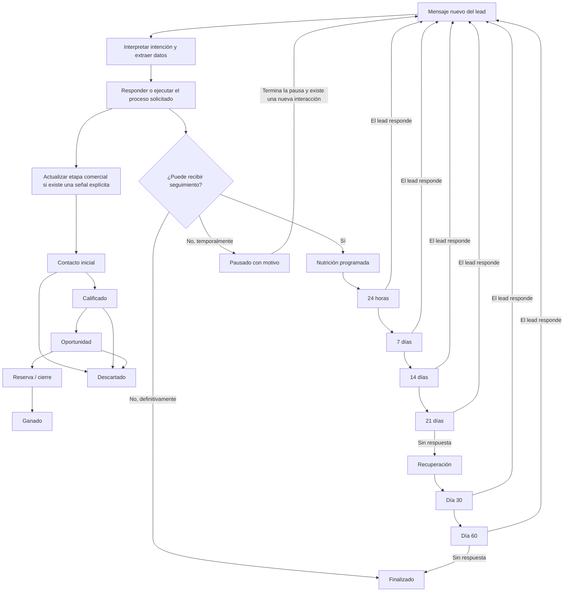

# Flujo de leads, nutrición y recuperación

**Versión:** 18 de septiembre de 2026

**Estado:** reglas funcionales acordadas y contrato para la implementación

**Alcance:** La Vilet y los demás proyectos que utilicen la automatización comercial

Este documento es la referencia principal para decidir en qué etapa se encuentra un lead, cuándo recibe nutrición y cuándo entra en recuperación. Si otro documento utiliza `Lanzamiento`, `Preventa` o `Nutrición` con un significado distinto, prevalecen las definiciones de este documento.

Las secciones 1 a 9 describen el comportamiento objetivo del producto. La sección 10 separa expresamente lo que ya funciona de lo que todavía debe desarrollarse; documentar una regla objetivo no significa que ya esté activa en producción.

## 1. Cinco conceptos que no se deben mezclar

Un mismo lead puede tener un valor distinto en cada eje. Ninguno sustituye a los demás.

| Eje | Qué responde | Valores principales | Alcance |
| --- | --- | --- | --- |
| Etapa comercial del proyecto | ¿Cómo se está comercializando el proyecto? | Lanzamiento, Preventa | Todo el proyecto |
| Estado físico de la obra | ¿Qué existe físicamente hoy? | Sin iniciar, En construcción, Obra terminada, Por verificar | Todo el proyecto |
| Etapa comercial del lead | ¿Qué tan avanzado está en su decisión de compra? | Contacto inicial, Calificado, Oportunidad, Reserva / cierre, Ganado, Descartado | Cada lead |
| Estado de seguimiento | ¿Qué debe hacer el sistema después? | Conversación activa, Nutrición programada, Recuperación, Pausado, Finalizado | Cada lead |
| Temperatura | ¿Qué intensidad muestran sus señales? | Frío, Tibio, Caliente | Cada lead |

### 1.1 Etapa comercial del proyecto

- **Lanzamiento:** se presenta la propuesta y los precios dependen del permiso de visibilidad configurado.
- **Preventa:** se comercializan unidades antes de la entrega.
- Es una configuración global del proyecto.
- Un mensaje del lead nunca cambia esta etapa.
- Esta etapa no indica si la obra ya comenzó.

### 1.2 Estado físico de la obra

- **Sin iniciar:** no se deben afirmar avances ni recorridos por unidades físicas.
- **En construcción:** solo se comunican avances verificados y con fecha.
- **Obra terminada:** se pueden ofrecer recorridos por los lugares autorizados y existentes.
- **Por verificar:** el bot evita afirmar un estado físico y deriva únicamente si la pregunta requiere un dato no verificado.
- Este estado controla afirmaciones sobre construcción, fotos de avances y lugares visitables. No cambia la etapa del lead.

### 1.3 Etapa comercial del lead

Esta es la línea principal del proceso de compra. `Nutrición` no pertenece a esta línea.

| Etapa visible | Criterio de entrada | Ejemplos de señales |
| --- | --- | --- |
| **Contacto inicial** | Lead nuevo o consulta general sin una necesidad estable identificada | “Quiero información”, “¿qué ofrecen?” |
| **Calificado** | Declara al menos una necesidad de compra útil y confiable | Tipo de unidad, propósito, dormitorios, presupuesto o unidad de interés |
| **Oportunidad** | Pide una acción o información comercial concreta | Precio, disponibilidad, cotización, comparación, financiamiento o visita |
| **Reserva / cierre** | Expresa que desea reservar o iniciar el paso formal de compra | Reserva, documentos, depósito o aceptación de una propuesta |
| **Ganado** | La venta quedó registrada | Contrato o cierre registrado |
| **Descartado** | Expresa que no tiene interés, el caso es inválido o se pierde formalmente | “No me interesa”, dato inválido confirmado o cierre perdido |

Mientras se migra la implementación, los nombres internos existentes se interpretan así:

| Valor interno actual | Nombre que debe mostrarse |
| --- | --- |
| `lanzamiento` | Contacto inicial |
| `precalificacion` | Calificado |
| `preventa` | Oportunidad |
| `reserva_venta` | Reserva / cierre |
| `nutricion` | Valor legado; debe salir de la etapa principal |

`Ganado` y `Descartado` pueden seguir dependiendo temporalmente del estado operativo del CRM hasta ampliar el modelo de etapas.

### 1.4 Estado de seguimiento

El seguimiento corre en paralelo a la etapa comercial:

| Estado | Significado |
| --- | --- |
| **Conversación activa** | El lead o el bot tienen un turno reciente que requiere atención inmediata |
| **Nutrición programada** | Hay al menos un contacto futuro permitido y programado |
| **Recuperación** | Terminó la nutrición ordinaria sin respuesta y se intenta reactivar al lead |
| **Pausado** | Existe una cita, financiamiento, atención humana u otra razón que impide enviar nutrición |
| **Finalizado** | No se enviarán más mensajes automáticos por venta, rechazo, baja o fin de recuperación |

Por ejemplo, un lead puede estar en **Oportunidad**, con temperatura **Tibia** y seguimiento **Nutrición programada** al mismo tiempo.

### 1.5 Temperatura

- La temperatura ayuda a ordenar prioridades.
- Se calcula con eventos y puntuación.
- No reemplaza la etapa comercial.
- Alcanzar temperatura caliente por puntos, sin una señal comercial explícita, no debe mover por sí solo al lead a Oportunidad.
- La pérdida de puntos por inactividad no hace retroceder automáticamente la etapa comercial.

## 2. Vista completa del flujo objetivo

Las dos ramas se actualizan por separado: la rama izquierda representa avance comercial; la derecha representa contacto posterior. Entrar en nutrición no reemplaza `Contacto inicial`, `Calificado` u `Oportunidad`.

## 3. Reglas para cambiar la etapa comercial del lead

### 3.1 Regla de prioridad

Si un mismo mensaje contiene varias señales, se conserva la etapa de mayor avance:

1. Ganado.
2. Reserva / cierre.
3. Oportunidad.
4. Calificado.
5. Contacto inicial.

La etapa no retrocede automáticamente. Una corrección manual debe quedar registrada con usuario, fecha y motivo.

### 3.2 Contacto inicial

Entra aquí todo lead nuevo o reiniciado. Permanece aquí mientras solo haga preguntas generales.

Ejemplo: “Hola, quiero información”. El bot responde la consulta y el lead queda en `Contacto inicial`. Si cumple los permisos, también queda con `Nutrición programada`.

### 3.3 Calificado

Avanza cuando la interpretación de alta confianza identifica al menos una necesidad estable:

- vivienda, suite, departamento o local;
- vivir, invertir, rentar o abrir un negocio;
- cantidad de dormitorios;
- presupuesto;
- unidad específica;
- plazo de compra.

El sistema guarda el dato extraído y su mensaje de origen. Una palabra aislada o ambigua no basta.

### 3.4 Oportunidad

Avanza con una petición comercial explícita:

- precio o cotización;
- disponibilidad de una unidad;
- comparación entre opciones;
- revisión o inicio de financiamiento;
- solicitud o aceptación inequívoca de una visita;
- siguiente paso concreto para comprar.

La puntuación o temperatura por sí sola no basta. El evento debe poder explicarse con el mensaje que lo originó.

### 3.5 Reserva / cierre

Avanza cuando el lead pide reservar, acepta una propuesta comercial concreta o solicita iniciar documentos o pago de reserva. Preguntar de forma informativa “¿cómo se reserva?” mantiene Oportunidad hasta que exista intención de avanzar.

### 3.6 Ganado y Descartado

- `Ganado` requiere un cierre registrado; el bot no lo infiere de un “listo” o “está bien”.
- `Descartado` requiere rechazo explícito, baja, caso inválido confirmado o decisión humana registrada.
- Un “gracias”, “listo” o “está bien” se interpreta con la última pregunta y el contexto; nunca cierra el lead por sí solo.

## 4. Regla de entrada a nutrición

Después del primer mensaje real del cliente que haya recibido una respuesta del bot aceptada por el proveedor, el lead queda en **Nutrición programada** si se cumplen todas estas condiciones:

- conversación por WhatsApp;
- IA activa para el lead;
- consentimiento de seguimiento en `true`;
- sin baja u oposición al seguimiento;
- sin traspaso humano activo;
- sin venta, reserva, descarte o cierre;
- sin una cita o evaluación de financiamiento activa que requiera pausa;
- la conversación pertenece al proyecto y no está fuera del ámbito inmobiliario.

Esto es lo que significa “el lead entra en nutrición desde el primer contacto”: se crea un próximo seguimiento; no se cambia su etapa comercial a `Nutrición` ni se envía un segundo mensaje inmediato.

Si falta consentimiento, la interfaz debe mostrar **Seguimiento pendiente de consentimiento**. No se envía una plantilla proactiva.

## 5. Secuencia de nutrición

El ancla es el último mensaje real del cliente que el bot respondió correctamente. Cada plazo se cuenta desde esa ancla y se ajusta al horario permitido.

| Momento | Objetivo | Restricción |
| --- | --- | --- |
| 24 horas | Retomar el asunto que quedó abierto | No repetir literalmente la respuesta anterior |
| Día 7 | Entregar material o información útil y pertinente | No reenviar brochure o material ya compartido |
| Día 14 | Ayudar a comparar, resolver una barrera o explicar una alternativa | Usar solo datos verificados del proyecto |
| Día 21 | Proponer un único siguiente paso claro | Una sola llamada a la acción |

Cada mensaje debe:

- usar el contexto vigente del lead;
- aportar algo nuevo;
- evitar describir o repetir lo que el lead acaba de decir;
- contener como máximo una pregunta o acción principal;
- respetar plantillas aprobadas, horario y límites de frecuencia;
- volver a comprobar elegibilidad inmediatamente antes de enviarse.

### 5.1 Si el lead responde

1. Se cancelan todos los seguimientos pendientes del ancla anterior.
2. Se interpreta y responde el nuevo mensaje.
3. Se actualizan datos, etapa y temperatura si corresponde.
4. Si sigue siendo elegible, se crea una secuencia nueva desde el último mensaje respondido.

No deben coexistir dos secuencias activas para el mismo contacto, proyecto y ancla.

### 5.2 Pausas

La nutrición se pausa cuando existe:

- coordinación, confirmación o reprogramación de visita activa;
- precalificación de financiamiento activa;
- asesor atendiendo el caso o traspaso aceptado;
- una pregunta del lead aún sin respuesta;
- un envío pendiente o de resultado incierto;
- reserva o venta;
- rechazo u oposición al seguimiento.

Cuando termina una pausa no se envía un mensaje antiguo vencido. La secuencia se reinicia solamente después de una nueva interacción atendida o de una reactivación manual explícita.

## 6. Recuperación

**Objetivo pendiente de implementación:** si el lead no responde al contacto del día 21, su seguimiento cambia a `Recuperación`. La etapa comercial se conserva.

| Momento | Acción |
| --- | --- |
| Día 30 desde el ancla | Primer intento de recuperación con valor nuevo y una sola acción |
| Día 60 desde el ancla | Último intento automático |
| Después del día 60 sin respuesta | Seguimiento finalizado / inactivo de largo plazo |

Para un lead en `Oportunidad` o `Reserva / cierre`, la entrada a recuperación debe crear además una tarea para un asesor con título **Recuperar lead**. El bot permanece activo hasta que un asesor acepte el traspaso.

La recuperación no se ejecuta cuando existe baja, rechazo explícito, venta, atención humana, cita activa, financiamiento activo o un envío incierto.

Si el lead responde durante la recuperación, se cancelan los intentos pendientes, el seguimiento vuelve a `Conversación activa` y se procesa el mensaje sin perder su etapa comercial anterior.

## 7. Inactividad, temperatura y recuperación

Son procesos distintos:

- **Inactividad:** tiempo desde el último mensaje del lead.
- **Decaimiento de temperatura:** reduce prioridad por falta de señales recientes.
- **Nutrición:** contactos programados durante los primeros 21 días.
- **Recuperación:** intentos posteriores para reactivar una conversación que no respondió.

Reducir la temperatura no envía mensajes ni cambia la etapa comercial. Entrar en recuperación no convierte al lead en `Contacto inicial`.

## 8. Estados operativos que puede ver el usuario

La ficha y la tabla de leads deben mostrar por separado:

| Campo visible | Ejemplo |
| --- | --- |
| Etapa comercial | Oportunidad |
| Seguimiento | Nutrición programada |
| Próxima acción | Seguimiento día 7, 25 sep. 2026 10:00 |
| Motivo de pausa | Visita pendiente de confirmación |
| Temperatura y puntos | Tibio, 35 puntos |
| Estado CRM | En contacto |

La línea de tiempo debe explicar cada decisión con eventos como:

- `followup_enrolled`;
- `followup_scheduled`;
- `followup_cancelled`;
- `followup_paused` y su motivo;
- `recovery_entered`;
- `recovery_task_created`;
- `followup_finished`;
- cambio de etapa con evento y mensaje de origen.

Cuando una cita queda confirmada por el cliente, el sistema registra una sola vez `appointment_confirmed`, suma 20 puntos, marca el estado operativo como `Agendado` y asigna el lead al mismo asesor responsable de la cita. La confirmación no apaga el bot; la asignación sí pausa la nutrición.

## 9. Ejemplos completos

### Consulta general

1. “Hola, quiero información”.
2. Etapa: `Contacto inicial`.
3. El bot responde.
4. Si cumple las condiciones: seguimiento `Nutrición programada`, próximo contacto a 24 horas.
5. El lead pregunta el precio: etapa `Oportunidad`; se cancelan los contactos anteriores y se crea una nueva secuencia tras responder.

### Solicitud de visita

1. El lead solicita una visita.
2. Etapa: `Oportunidad`.
3. Seguimiento: `Pausado`, motivo `visita_activa`.
4. Agenda atiende la coordinación. No se envían mensajes genéricos de nutrición mientras la cita esté activa.

### Rechazo

1. “No me interesa y no deseo más mensajes”.
2. Etapa: `Descartado`.
3. Seguimiento: `Finalizado`.
4. Se cancelan todos los trabajos pendientes y se registra la oposición.

### Silencio prolongado

1. Un lead en `Oportunidad` no responde a 24 horas, 7, 14 ni 21 días.
2. El seguimiento cambia a `Recuperación`; la etapa sigue siendo `Oportunidad`.
3. Día 30: mensaje de recuperación y tarea para asesor.
4. Día 60: último intento automático.
5. Sin respuesta: seguimiento `Finalizado / inactivo de largo plazo`.

## 10. Estado de implementación al 18 de septiembre de 2026

| Capacidad | Estado actual |
| --- | --- |
| Separar etapa comercial del proyecto y estado físico de obra | Implementado |
| Etapas internas del lead | Implementado parcialmente, con nombres ambiguos |
| `Nutrición` dentro de la etapa principal | Existe como valor legado; no hay una transición automática activa hacia él |
| Programar 24 horas, día 7, día 14 y día 21 | Implementado en el ejecutor, condicionado por controles, activación, plantillas, consentimiento y elegibilidad |
| Cancelar tareas de nutrición al recibir un mensaje nuevo | Implementado |
| Cita confirmada suma puntos y conserva el asesor de la cita | Implementado mediante `20260918233000_confirmed_visit_hot_lead.sql` |
| Mostrar un estado de seguimiento separado en la UI | Pendiente |
| Recuperación de día 30 y día 60 | Pendiente |
| Tarea de asesor `Recuperar lead` | Pendiente |
| Decaimiento de temperatura | Existe como mantenimiento separado y depende de su activación global; no equivale a recuperación |

Las tablas legadas `lead_nutrition`, `nutrition_delivery_history` y `lead_recovery` no deben mezclarse con los trabajos actuales del ejecutor sin una migración explícita. La programación actual usa eventos de mantenimiento en `lv_integration_events`.

## 11. Cambios necesarios para cumplir todo el flujo

1. Renombrar en la interfaz las etapas actuales del lead y retirar `Nutrición` de la lista principal.
2. Guardar un estado de seguimiento separado, su próxima acción, el ancla y el motivo de pausa.
3. Evitar que la temperatura caliente cambie por sí sola la etapa a Oportunidad.
4. Implementar recuperación en días 30 y 60, con límites e idempotencia.
5. Mostrar el recorrido de cada mensaje y cada transición en la línea de tiempo o en el futuro visualizador de Workflow.
6. Unificar o retirar las tablas legadas para que exista una sola fuente de verdad.

## 12. Criterios de aceptación

- Un lead puede verse como `Oportunidad + Nutrición programada + Tibio` sin contradicción.
- El modo Lanzamiento o Preventa del proyecto nunca cambia por una conversación.
- El estado de obra nunca cambia la etapa comercial del lead.
- Una respuesta del lead cancela una sola vez todos los contactos pendientes del ancla anterior.
- Una cita, financiamiento o atención humana activa pausa la nutrición.
- Un rechazo u oposición cancela definitivamente el seguimiento.
- Ningún contacto se envía dos veces para el mismo lead, ancla y paso.
- Cada cambio puede explicar qué mensaje o acción lo produjo.
- Después del día 21 sin respuesta se entra en recuperación; después del día 60 se detienen los mensajes automáticos.
