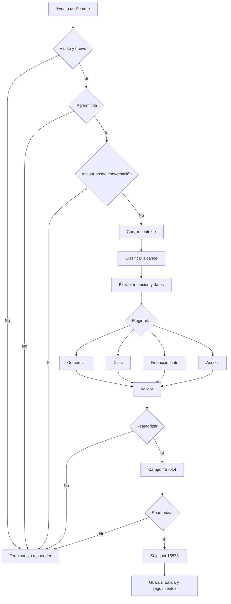

# Flujo completo de un mensaje

## 1. Recepción

Kommo llama `POST /api/integrations/kommo/webhook`. El endpoint:

1. valida el secreto del webhook;
2. exige que el ejecutor esté en modo `live`;
3. acepta únicamente la cuenta Kommo `36919007`;
4. procesa mensajes entrantes cuyo autor es externo;
5. separa las salidas manuales cuyo autor es un usuario interno de Kommo;
6. acepta los orígenes `waba` y `whatsapp`;
7. rechaza identificadores, fechas y cuerpos inválidos;
8. ignora mensajes anteriores a `AUTOMATION_ACTIVATED_AT`;
9. guarda el evento antes de confirmar la recepción.

La respuesta automática no puede comenzar antes de que Kommo entregue el evento `message[add]`. Si WhatsApp o Kommo retienen un evento, el sistema no conoce todavía el mensaje y no puede contestarlo. Las respuestas manuales requieren además la suscripción `add_outgoing_message`; se registran como `advisor_outbound` y tienen prioridad sobre un mensaje entrante pendiente del mismo chat.

Cuando el autor saliente es interno, el sistema registra el mensaje con rol `asesor`, conserva al responsable que ya tiene el lead, cambia `bot_enabled=false`, refleja `DETENER IA=true` en Kommo y cancela los seguimientos de nutrición pendientes. Si existe una relación directa mediante `kommo_user_id`, también queda identificado el usuario interno. Las entregas de Salesbot se descartan por el tipo de autor y por coincidencia con el mensaje automático registrado.

## 2. Cola y ejecutor

Los eventos viven en `lv_integration_events`. El ejecutor `/api/integrations/automation/run` requiere un secreto de cron y utiliza un bloqueo exclusivo para evitar dos workers simultáneos.

El worker:

- reclama eventos pendientes por contacto;
- agrupa mensajes consecutivos del mismo lead;
- cancela seguimientos anteriores cuando llega una entrada nueva;
- procesa hasta tres lotes por ejecución dentro de su límite de tiempo;
- trata una entrega ambigua como `uncertain`, sin reenviarla automáticamente;
- ejecuta mantenimiento de citas, nutrición y decaimiento únicamente cuando la configuración lo permite.

En modo de pruebas, el webhook puede despertar el worker después del retraso corto configurado para el lead autorizado. El cron sigue siendo el respaldo para eventos persistidos.

## 3. Registro del mensaje

Antes de interpretar el texto, `register()`:

- comprueba que el contacto pertenece al lead de Kommo;
- obtiene un teléfono válido;
- intenta interpretar audios o adjuntos;
- registra cada entrada mediante `register_inbound_message`;
- conserva atribución CTWA cuando Kommo la entrega;
- detecta duplicados;
- valida que la conversación y el lead coincidan;
- conserva la hora original del proveedor.

Un duplicado termina con `action=duplicate` y no genera otra respuesta.

## 4. Controles previos

El sistema termina sin responder cuando ocurre cualquiera de estas condiciones:

| Control | Resultado |
| --- | --- |
| Mensaje con 24 horas o más de antigüedad | `expired` |
| Automatización apagada o en simulación | `disabled` |
| Lead distinto del autorizado en modo de pruebas | `outside_test_lead` |
| `bot_enabled` desactivado, opt-out o `DETENER IA` en Kommo | `bot_paused` |
| El último mensaje saliente de esta conversación fue de un asesor | `human_attention` |

La asignación de un asesor por sí sola no apaga al bot. La pausa humana se decide por actividad real del asesor en la conversación actual.

## 5. Contexto

La RPC `lv_app_conversation_context` reúne:

- historial reciente;
- última respuesta real del bot;
- resumen persistido;
- citas y propuestas;
- coordinación de visita en curso;
- datos del lead;
- estado de proyecto;
- catálogo y políticas relacionadas.

Después se incorporan el catálogo publicado, precios permitidos, instalaciones, ubicación, entidades financieras, estado físico del proyecto y memoria comercial.

## 6. Interpretación en dos niveles

Primero se clasifica el alcance del negocio:

| Clase | Significado |
| --- | --- |
| `property` | Consulta inmobiliaria de La Vilet. |
| `out_of_scope` | Solicitud exclusivamente ajena al proyecto. |
| `mixed` | El turno contiene una solicitud inmobiliaria y otra ajena. |
| `neutral` | Saludo, cortesía o mensaje sin una solicitud resoluble. |

Una continuación financiera reconocida se conserva como inmobiliaria antes de ejecutar este clasificador. Así, “soy desarrollador, llevo 6 meses y gano 1000” sigue siendo una respuesta financiera si el bot acababa de pedir esos datos.

Después, el extractor semántico convierte el mensaje actual en datos estructurados:

- eventos comerciales;
- categoría y propósito;
- datos de calificación;
- consentimiento de seguimiento;
- opt-out;
- solicitud de asesor;
- intención y preferencia de visita;
- entidad y datos de financiamiento.

El extractor puede corregir ortografía para interpretar el sentido, pero la evidencia de una fecha, hora o intención debe existir literalmente en el turno. El historial da contexto; no crea un evento nuevo.

## 7. Enrutamiento

El orden importa. Antes de una respuesta comercial genérica, el sistema atiende rutas más específicas:

1. alcance ajeno o ambiguo;
2. asistencia del equipo a una cita;
3. aclaración de casas frente a los productos de La Vilet;
4. solicitudes ajenas de vehículos;
5. brochure;
6. aceptación de una opción de precio;
7. aclaración de archivos o acciones no registradas;
8. rechazo de seguimiento;
9. estado de una cita;
10. ubicación solicitada directamente;
11. reparación de contexto, como “no entendí”;
12. aceptación ambigua de una visita;
13. cortesía o saludo mínimo;
14. propuesta de visita pendiente;
15. opt-out;
16. financiamiento;
17. solicitud de visita;
18. solicitud explícita de asesor;
19. respuesta comercial general.

## 8. Control de calidad

La respuesta pasa por varias comprobaciones:

- que conteste los temas del turno actual;
- que no repita preguntas ya contestadas;
- que no invente precios, acciones, disponibilidad o hechos;
- que distinga una preferencia de una cita confirmada;
- que no cambie el lugar de visita;
- que mantenga la continuidad de financiamiento;
- que no oculte un traspaso ya registrado;
- que no exceda 3000 caracteres;
- que use saludo y nombre solo cuando correspondan.

El revisor puede corregir una redacción. No puede autorizar un precio distinto del catálogo ni convertir una coordinación en una cita confirmada.

## 9. Autorización inmediatamente antes del envío

El permiso se comprueba dos veces: antes de escribir la respuesta en Kommo y antes de lanzar el Salesbot. En ambas revisiones se valida:

- configuración vigente;
- lead correcto;
- `bot_enabled` y opt-out;
- mensaje dentro de 24 horas;
- `DETENER IA` remoto;
- ausencia de una respuesta posterior del asesor;
- ausencia de una entrada más nueva pendiente.

Además, una salida de visita `claimed` o `uncertain` bloquea otro envío hasta su revisión.

## 10. Entrega y persistencia

La respuesta se escribe en el campo Kommo `457014` y se lanza el Salesbot `15578`. Solo después de que Kommo acepta la operación se registra el mensaje saliente.

Al final se actualizan:

- resumen de conversación;
- memoria comercial;
- referencia de unidad;
- tours enviados;
- estado de financiamiento o visita;
- tareas de nutrición elegibles.

