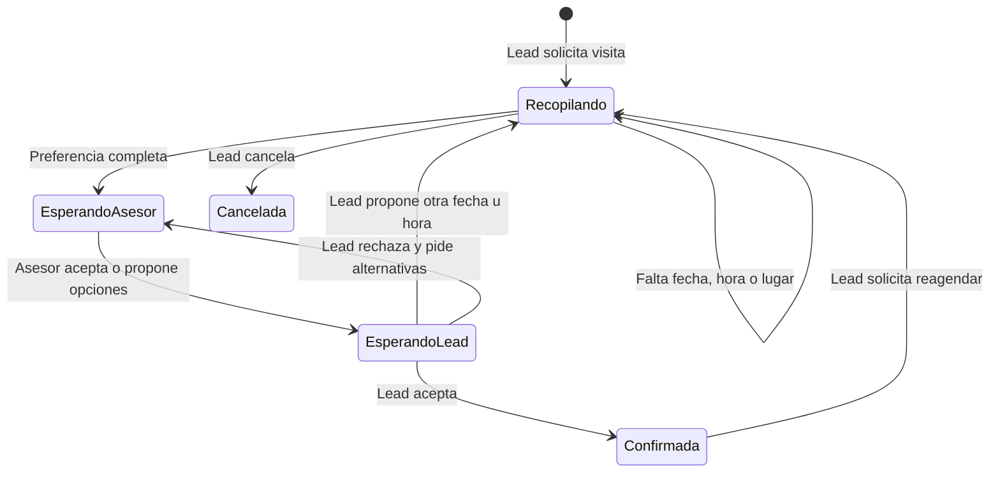
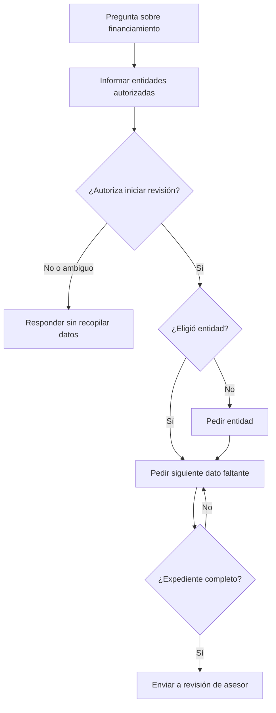

# Citas y financiamiento

## Citas: estados principales

## Reglas para solicitar una visita

- “Quiero agendar”, “puedo visitar” y equivalentes con errores ortográficos activan visita.
- Una cita médica, un vuelo u otra agenda ajena no activan este flujo.
- Si falta fecha u hora, el bot pide solo el dato faltante.
- El horario se valida en `America/Guayaquil` y la duración operativa es de una hora.
- Una fecha cerrada, pasada o fuera de horario no se envía al asesor como si fuera válida.
- El cambio local pendiente muestra primero los días y horas autorizados antes de pedir una preferencia.
- El bot dice “revisaremos disponibilidad”; no afirma que la cita está confirmada.

## Agendar y reagendar

- Una solicitud nueva crea una coordinación de tipo **Agendar**.
- Si existe una cita confirmada y el lead pide cambiarla, la coordinación es **Reagendar**.
- El título de la notificación al asesor debe reflejar esa acción.
- Al reagendar se conserva el asesor responsable de la cita existente.
- Si el lead no sabe cuándo puede, el bot ofrece horarios autorizados.
- Si rechaza todas las opciones sin proponer otra, se crea una intervención humana y el bot permanece activo hasta que el asesor tome realmente la conversación.

## Confirmación

La cita solo se considera confirmada cuando coinciden:

- solicitud vigente;
- asesor y horario vigentes;
- aceptación del asesor;
- aceptación del lead;
- cita actualizada con estado permitido.

Al confirmarse por el lead:

- se conserva el mismo asesor de la cita;
- el lead pasa a estado operativo `agendado`, salvo que ya tenga un estado final;
- se registra `appointment_confirmed` una sola vez;
- la puntuación de ese evento vale al menos 20 puntos y completa lo necesario para alcanzar el umbral `caliente`;
- se programan confirmación y recordatorios según las rutas habilitadas.

Esta regla está versionada en `20260918233000_confirmed_visit_hot_lead.sql`.

## Mensajes de cita

Antes de enviar una propuesta, confirmación o recordatorio, el sistema vuelve a comprobar:

- que el job siga vigente;
- que lead, cita y solicitud pertenezcan al mismo proyecto;
- que el asesor, horario y opciones no hayan cambiado;
- que no exista una entrega incierta;
- que el canal sea WhatsApp y no exista opt-out;
- que el Salesbot y sus campos estén aprobados.

Para mensajes libres se respeta la ventana de 24 horas. El recordatorio de dos horas usa una plantilla aprobada y puede salir fuera de esa ventana.

### Recordatorio dos horas antes

| Elemento | Valor |
| --- | --- |
| Salesbot | `22246` |
| Saludo La Vilet | campo `531808` |
| Detalle de cita La Vilet | campo `531120` |
| Ubicación La Vilet | campo `531812` |

El saludo depende de la hora de envío y solo incluye el nombre cuando parece un nombre real. El detalle usa fecha, hora, asesor y motivo confirmados. La ubicación debe ser una URL válida de Google Maps o una búsqueda generada desde la dirección verificada.

## Financiamiento

Reglas:

- Las entidades se leen de `project_financing_partners`; no del catálogo global de bancos.
- Elegir una entidad por sí solo no equivale a autorizar una precalificación.
- Se requiere consentimiento explícito para iniciar la recopilación.
- Una pregunta informativa sobre crédito no abre una solicitud.
- Se conserva el progreso entre turnos y se pide un solo dato faltante por vez.
- Una respuesta natural al último dato pedido continúa el flujo aunque tenga faltas ortográficas.
- Si el lead cambia de tema, se responde el tema nuevo sin borrar los datos financieros ya guardados.
- El sistema no promete aprobación y no presenta al proyecto como otorgante de crédito directo.
- Si una escritura financiera queda incierta o el estado es desconocido, se deriva para revisión sin volver a pedir todos los datos.
