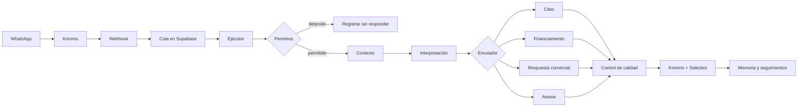

# Automatización de La Vilet: referencia canónica

**Revisión:** 22 de septiembre de 2026. Motor conversacional v2: cambios locales pendientes de despliegue.
**Alcance:** mensajes de WhatsApp recibidos mediante Kommo, respuestas del bot, citas, financiamiento, nutrición y traspasos a asesores.
**Propósito:** explicar el comportamiento real sin mezclar reglas activas, cambios locales y propuestas futuras.

## Cómo leer el estado de una regla

| Estado | Significado |
| --- | --- |
| **Versionada** | Está en el `HEAD` de `main`. Aun así, su funcionamiento en producción depende de que el despliegue y las migraciones correspondientes hayan terminado correctamente. |
| **Configurada** | Depende de datos de Supabase, Kommo o variables del entorno. El código existe, pero puede estar apagada o limitada por configuración. |
| **Local pendiente** | Existe en este espacio de trabajo, pero todavía no se ha confirmado ni subido al repositorio. No se debe asumir que funciona en Vercel. |
| **Planificada** | Es una regla acordada o documentada que aún no está implementada por completo. |

La fuente de verdad se consulta en este orden:

1. Estado operativo en Kommo, Supabase y variables de Vercel.
2. Código y migraciones realmente desplegados.
3. Esta documentación, que explica esos componentes.
4. Los documentos antiguos de `docs/`, que quedan como historial y pueden describir estados anteriores.

## Por qué `/cuenca-azuay` devuelve 404

`/cuenca-azuay` no tiene un archivo `page.tsx` en el App Router, por lo que Next.js responde correctamente con **404**. La vista del flujo está en:

```text
http://localhost:3000/inmobiliaria/automatizacion/workflow
```

Esa ruta es privada. Se necesita una sesión válida y permiso para `/inmobiliaria/automatizacion`. La API de ejecuciones reales exige además rol `admin`. La página y su pestaña están en estado **local pendiente**; si se prueba en un despliegue remoto todavía no aparecerán hasta que se suban y desplieguen.

## El modelo mental correcto

La automatización no es una sola función. Es una cadena coordinada:



## Cinco estados que nunca deben confundirse

| Eje | Pertenece a | Ejemplos | Qué controla |
| --- | --- | --- | --- |
| Etapa comercial del proyecto | Proyecto | Lanzamiento, Preventa | Cómo se presenta y comercializa el proyecto. |
| Estado físico de la obra | Proyecto | Sin iniciar, En construcción, Terminado | Qué se puede afirmar y qué lugares se pueden visitar. |
| Etapa comercial del lead | Lead | Contacto inicial, Calificado, Oportunidad, Reserva/cierre | Avance del proceso comercial. |
| Temperatura | Lead | Frío, Tibio, Caliente | Prioridad calculada con puntos. |
| Estado de seguimiento | Lead/conversación | Activo, nutrición, pausado, recuperación, finalizado | Qué contacto automático debe ocurrir después. |

Un lead puede estar al mismo tiempo en **Oportunidad**, **Tibio** y con **nutrición programada**. “Lanzamiento” no describe al lead y “Nutrición” no debería utilizarse como etapa comercial.

## Documentos de esta referencia

1. [Flujo completo](./01-flujo-completo.md): recorrido técnico y operativo de cada mensaje.
2. [Reglas de decisión y respuesta](./02-reglas-de-decision.md): prioridades, clasificador, extractor, pausas y validadores.
3. [Reglas comerciales](./03-reglas-comerciales.md): catálogo, precios, alternativas, ubicación, materiales y tours.
4. [Citas y financiamiento](./04-citas-y-financiamiento.md): estados, notificaciones, recordatorios y precalificación.
5. [Leads, temperatura y seguimiento](./05-leads-y-seguimiento.md): etapas, puntos, nutrición y recuperación.
6. [Configuración y mapa del código](./06-configuracion-y-codigo.md): pantallas, tablas, Salesbots, campos y módulos responsables.
7. [Motor conversacional y diagnóstico por turno](./07-motor-conversacional.md): contrato común, catálogo, memoria, trazas y pruebas.
8. [Caso de continuidad del 22 de septiembre](./08-regresion-conversacional-2026-09-22.md): fallos observados, correcciones y límites de la validación local.

## Qué permite ver el flujo visual

La pantalla de Workflow es de solo lectura. Contiene mapas para:

- recorrido principal;
- pausas de la IA;
- citas y visitas;
- financiamiento;
- nutrición.

Cuando la instrumentación local sea desplegada, una ejecución podrá mostrar sus pasos reales, duración, resultado y módulo responsable. Si una ejecución ocurrió antes de esa instrumentación, la interfaz solo puede reconstruir una ruta aproximada a partir del resultado guardado.
