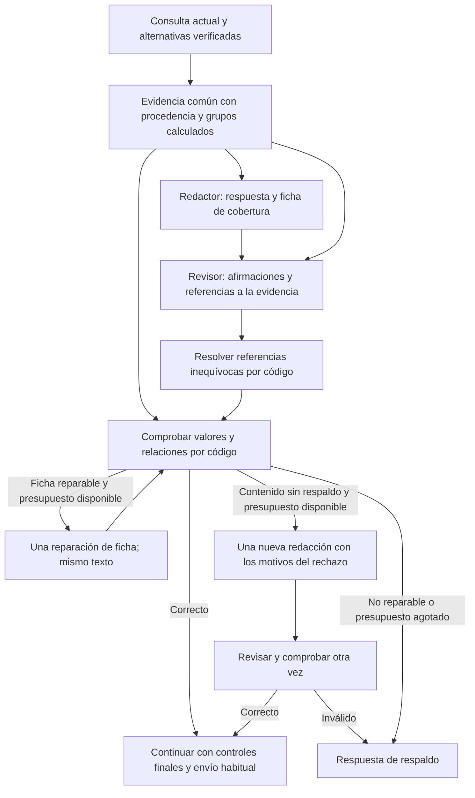

# Validación de respuestas con evidencia compartida

Fecha: 25 de septiembre de 2026. Base de comparación: `4a266e7`.

Estado: implementado en el repositorio local; pendiente de commit, push y despliegue. Este documento no acredita que Vercel ya esté ejecutando estos cambios. No hay migraciones SQL en este paquete.

## Qué problema se corrige

Una respuesta bien escrita podía rechazarse por una ficha interna defectuosa, aunque sus datos fueran correctos. Se encontraron tres causas distintas:

1. La consulta de viviendas de cinco o seis dormitorios no devolvía coincidencias. El redactor recibía alternativas, pero el control de relaciones unidad–dato podía usar únicamente el resultado vacío de la consulta original. Por eso no encontraba unidades que sí estaban verificadas como alternativas.
2. El revisor podía escribir el número visible `603` donde el contrato esperaba el identificador interno de esa unidad, o citar una frase resumida que no aparecía literalmente en la respuesta.
3. Un resumen de categoría («penthouses de hasta 142,09 m² interiores») podía convertirse en fichas individuales que atribuían ese máximo a todas las unidades, incluida una de 140,53 m². El máximo del grupo y la medida de cada unidad son hechos diferentes.

Además, la consulta conservaba un solo número de dormitorios: podía comprobar seis cuando el cliente había preguntado por cinco o seis. Este problema se corrige en la representación de la consulta, no agregando otra frase permitida al redactor.

## Nuevo funcionamiento

El límite de reparación se aplica dentro de `completeTurnReply`: no se encadena una reparación de ficha con otra de contenido. El diagrama muestra las dos rutas posibles, no un ciclo ilimitado. Los otros generadores y revisores de la automatización conservan sus propios recorridos.

### Evidencia y libertad de redacción

`evidencia_turno` reúne las unidades de la consulta original y las alternativas efectivamente consultadas. Cada unidad conserva su procedencia. La consulta original y sus resultados permanecen separados de la consulta de alternativas: encontrar alternativas de tres dormitorios no convierte en exitosa una búsqueda de cinco o seis.

El código calcula mínimos y máximos por categoría y cantidad de dormitorios. Por ejemplo, `group:penthouse:3:max` representa un grupo concreto y sus máximos conocidos. Si algún miembro carece de una medida, el grupo no publica un máximo de esa medida como si todos sus datos estuvieran completos.

El redactor y el revisor reciben esta misma evidencia. El control numérico utiliza las mismas unidades y grupos. El control final del catálogo también considera la unión de los resultados originales y las alternativas.

El redactor puede organizar, resumir y omitir datos secundarios que no respondan a la consulta. Puede elegir una continuación útil cuando no haya una decisión protegida. Para una consulta familiar, las instrucciones permiten orientar con categorías verificadas y preguntar por dormitorios, sin asumir tamaño familiar ni capacidad de ocupación.

Se conservan las decisiones operativas protegidas, enlaces obligatorios, controles de precios, correspondencia entre unidad y medida, y prohibiciones de inventar acciones. La libertad no permite afirmar que una cita está confirmada, inventar un precio ni dar por seleccionada una unidad.

### Ficha interna más sencilla

El sistema divide el borrador en referencias `S1`, `S2`, etc. El revisor puede citar esos identificadores; el código recupera el texto exacto. Así no tiene que reconstruir literalmente una frase larga para justificar cada dato. Las citas literales anteriores siguen siendo compatibles.

Si el revisor entrega un número de unidad en lugar de su ID, el código lo resuelve únicamente cuando existe una sola coincidencia en la evidencia autorizada. No consulta otras unidades para forzar la aceptación. Si el número es ambiguo, no lo convierte automáticamente.

Esta normalización no modifica el mensaje ni los valores del revisor. Una ficha con «cinco dormitorios» sigue rechazándose si la unidad tiene tres, aunque su identificador haya podido corregirse.

### Reparación y respaldo

| Situación | Tratamiento |
| --- | --- |
| Referencia `S1` o número de unidad inequívoco | Normalización por código, sin otra llamada a IA. |
| Error reparable en la ficha de relaciones numéricas | Una llamada para reparar esa ficha, conservando el texto; se vuelven a validar las relaciones. No se permite borrar hechos para evadir controles. |
| Dato comercial discrepante, afirmación sin respaldo o cobertura desaprobada | Si no se consumió el intento, nueva redacción con los controles y evaluación anterior, seguida de revisión independiente. |
| Evidencia contradictoria para una misma unidad | No se pide al modelo que resuelva la contradicción como si fuera un problema de estilo; el borrador no se aprueba. |
| Reparación inválida o servicio fallido | Se conserva el respaldo y queda registrado el rechazo o el fallo de reparación. |

Las condiciones anteriores no habilitan reparaciones para todas las reglas del sistema: siguen existiendo rechazos inmediatos de controles de enlaces, acciones y otras restricciones. Tampoco garantizan que toda respuesta agradable sea válida: afirmaciones como «balcones privados» necesitan evidencia, aunque suenen naturales.

### Consultas con varias cantidades de dormitorios

La ficha del extractor y la consulta incorporan `bedrooms_any`. Una petición «cinco o seis dormitorios» representa `[5,6]`, con `bedrooms=null`. Se buscan ambas cantidades. Si existe una vivienda de cinco, el sistema no responde que no encontró ninguna de cinco o seis.

El modelo puede representar más de dos alternativas explícitas. El apoyo léxico cubre disyunciones de dos cantidades, con cifras o palabras; no convierte rangos como «entre cinco y seis» en una disyunción ni presupuestos en dormitorios. No es una promesa de interpretar cualquier frase sin errores.

Cuando el cliente acepta las alternativas ofrecidas, se usa la consulta alternativa. La preferencia original se conserva como antecedente, pero no se vuelve a aplicar automáticamente para negar las alternativas aceptadas.

## Ejemplos esperados

Estos textos ilustran el resultado deseado; no son plantillas obligatorias ni nuevas garantías de disponibilidad.

**Cliente:** «¿Tiene opciones de cinco o seis dormitorios?»

Con una búsqueda completa sin coincidencias y las alternativas verificadas del caso:

> Actualmente, La Vilet no dispone de viviendas de cinco o seis dormitorios. Podemos ofrecerle departamentos de tres dormitorios, de hasta 120,83 m² interiores, y penthouses de tres dormitorios, de hasta 142,09 m² interiores. ¿Cuál de estas opciones le interesa más?

Ese resumen puede validarse contra los máximos de los grupos; no exige atribuir 142,09 m² a cada penthouse ni listar todas las unidades.

**Cliente:** «Me interesan más los penthouses» después de aceptar alternativas.

> El penthouse 602 tiene 142,09 m² interiores y dos baños completos; el 605 tiene 140,53 m² interiores y tres baños completos. ¿Cuál le gustaría conocer?

Las medidas y baños deben estar verificados en ese turno. El sistema no debe volver a negar cinco o seis dormitorios por recuperar el filtro anterior.

**Cliente:** «Busco algo para vivir con mi familia» sin requisitos definidos.

> Tenemos departamentos y penthouses con distintas distribuciones. ¿Cuántos dormitorios necesita su familia?

Es una orientación posible si esas categorías están verificadas y no existe un requisito o pregunta pendiente más pertinente. No autoriza al bot a deducir que toda familia necesita tres dormitorios.

## Qué verá en la interfaz

En el paso **Revisión de la respuesta**, el panel de decisión muestra la aprobación o rechazo y agrupa los controles por causa. Por ejemplo: «Los valores declarados no coinciden con los datos verificados (3 comprobaciones afectadas)».

El desplegable **Ver las N comprobaciones individuales** conserva el fragmento, campo, identificador y valores recibido/esperado cuando existen en el registro. Se informa también de las referencias resueltas automáticamente y de los intentos de reparación. Se evita repetir la lista completa en la sección general «Error detectado».

Los registros históricos no se vuelven a ejecutar ni se convierten retroactivamente en aprobaciones. Si no guardaron la causa concreta, la interfaz mantiene esa limitación en lugar de atribuirles la nueva política.

## Costes y alcance

- No se añade un agente obligatorio a cada mensaje. En la etapa final normal siguen siendo redactor y revisor cuando corresponde revisar.
- Resolver referencias por código no añade llamadas.
- Una reparación de ficha añade una llamada. Una reparación comercial añade una redacción y una revisión. Estos son límites de esta etapa, no del total de agentes del mensaje.
- La evidencia y sus grupos añaden contenido al prompt; por ello los tokens pueden aumentar aunque el número de llamadas no cambie. No se ha medido un porcentaje de coste con tráfico real.
- No se cambian puntos, temperatura, enfriamiento, reglas de activación, modo de prueba, funciones de reinicio, recepción Kommo ni migraciones de Pablo.
- No se implementa aquí la propuesta futura completa de memoria comercial unificada, checklist comercial o planificación de objetivos. Tampoco se eliminan todos los controles lingüísticos restantes.

## Mapa de archivos

Las líneas corresponden a esta revisión local. Los rangos exactos añadidos/modificados frente a `4a266e7` aparecen en el anexo generado al final; cambiar el archivo posteriormente puede desplazarlos.

| Archivo | Función del cambio |
| --- | --- |
| [turn-evidence.ts](../../src/lib/integrations/automation/turn-evidence.ts) | Nuevo módulo: evidencia común, procedencia, grupos calculados, referencias a oraciones y normalización inequívoca. |
| [turn-completeness.ts](../../src/lib/integrations/automation/turn-completeness.ts) | Integra la evidencia, permite mencionar las cantidades consultadas, revisa el contrato del redactor y aplica el presupuesto de reparación con auditoría. |
| [semantic-review.ts](../../src/lib/integrations/automation/semantic-review.ts) | Instrucciones para referencias de oraciones y grupos; contraste de negaciones con filtros de varias cantidades. |
| [response-plan.ts](../../src/lib/integrations/automation/response-plan.ts) | Incluye alternativas en los hechos; distingue decisión protegida de libertad para organizar la respuesta. |
| [bedroom-options.ts](../../src/lib/integrations/automation/bedroom-options.ts) | Nuevo módulo: normalización de listas de dormitorios y apoyo léxico conservador. |
| [turn-semantics.ts](../../src/lib/integrations/automation/turn-semantics.ts) | Esquema, instrucciones y normalización del extractor para varias cantidades. |
| [property-context.ts](../../src/lib/integrations/automation/property-context.ts) | Conserva las cantidades solicitadas y retira ese filtro al aceptar una consulta alternativa. |
| [catalog-dialogue.ts](../../src/lib/integrations/automation/catalog-dialogue.ts) | Busca todas las cantidades; la base menciona la consulta completa; validación final usa originales y alternativas. |
| [reviewDecision.ts](../../src/components/inmobiliaria/automation/workflow/reviewDecision.ts) | Agrupa causas, explica normalizaciones y distingue la política actual de registros antiguos. |
| [MessageTraceView.tsx](../../src/components/inmobiliaria/automation/workflow/MessageTraceView.tsx) | Resumen visible y comprobaciones individuales desplegables. |
| [messageExplanation.ts](../../src/components/inmobiliaria/automation/workflow/messageExplanation.ts) | Evita duplicar todos los errores en el resumen de ejecución. |
| [turn-completeness.test.cjs](../../scripts/turn-completeness.test.cjs) | Regresiones de alternativas, agregaciones, referencias ambiguas, datos incorrectos y reparaciones limitadas. |
| [catalog-dialogue.test.cjs](../../scripts/catalog-dialogue.test.cjs) | Regresiones de varias cantidades y continuidad al aceptar alternativas. |
| [messageExplanation.test.ts](../../src/components/inmobiliaria/automation/workflow/messageExplanation.test.ts) | Resumen por causa con conservación de detalle y resultados de reparación. |

## Validación

- `npm run test:conversation`: 196/196 aprobadas.
- `npm run test:integrations`: 221/221 aprobadas.
- `npm run test:message-trace`: 24/24 aprobadas.
- `npx tsc --noEmit`: aprobado.
- `npm run build`: compilación de producción local aprobada.
- `npm run test:automation`: 117/118 aprobadas. La prueba `rejects unsolicited prices in a generated category-choice reply` espera `style` y recibe `unsupported_fact`. Se reprodujo el mismo fallo cargando los fuentes de `HEAD` (`4a266e7`) directamente mediante `git show`, sin estos cambios. No se cambió esa expectativa ni la regla de precios para ocultar el fallo.
- ESLint sobre los archivos TypeScript modificados: un error previo `react-hooks/set-state-in-effect` en `MessageTraceView.tsx:70`. También se reprodujo pasando el archivo de `HEAD` a ESLint por entrada estándar. El bloque modificado de esta vista está en las líneas 216–217; el efecto previo no se cambió.
- Comprobación final de la reparación: `node --test scripts/turn-completeness.test.cjs`, 47/47 aprobadas; TypeScript volvió a aprobar después del último ajuste del contexto de reparación.

Las pruebas usan salidas controladas de los modelos; comprueban las decisiones del código y sus límites. No equivalen a una evaluación estadística del modelo real ni a una prueba de envío en WhatsApp. Después del despliegue corresponde repetir el recorrido de Carlos y revisar los prompts, respuestas y motivos registrados.

## Comparación y reversibilidad

La referencia anterior es `4a266e7`; los cambios están separados por archivo en el diff local. Este paquete no transforma datos persistidos ni borra historial. Si se publica y luego hace falta revertirlo, se debe revertir el commit específico de este paquete, conservando el trabajo posterior de otras personas.

No use una restauración global del repositorio para revertirlo junto con cambios ajenos. Los registros de ejecuciones generados mientras estuviera activo conservan la política con la que fueron evaluados.

## Anexo: líneas modificadas

<!-- CHANGE_LINES -->

Rangos extraidos de `git diff --unified=0 HEAD` y de los dos modulos nuevos. Una fila con cero lineas nuevas representa una eliminacion; la referencia nueva indica su punto de insercion.

| Archivo | Lineas anteriores | Lineas nuevas |
| --- | --- | --- |
| [docs/automatizacion/README.md](../../docs/automatizacion/README.md#L3) | sin lineas | 3-4 |
| [scripts/catalog-dialogue.test.cjs](../../scripts/catalog-dialogue.test.cjs#L28) | sin lineas | 28-67 |
| [scripts/turn-completeness.test.cjs](../../scripts/turn-completeness.test.cjs#L55) | 55 | 55 |
| [scripts/turn-completeness.test.cjs](../../scripts/turn-completeness.test.cjs#L186) | 186 | 186-187 |
| [scripts/turn-completeness.test.cjs](../../scripts/turn-completeness.test.cjs#L511) | 510 | 511-512 |
| [scripts/turn-completeness.test.cjs](../../scripts/turn-completeness.test.cjs#L565) | 563 | 565 |
| [scripts/turn-completeness.test.cjs](../../scripts/turn-completeness.test.cjs#L575) | 573-576 | 575-577 |
| [scripts/turn-completeness.test.cjs](../../scripts/turn-completeness.test.cjs#L588) | sin lineas | 588-663 |
| [src/components/inmobiliaria/automation/workflow/MessageTraceView.tsx](../../src/components/inmobiliaria/automation/workflow/MessageTraceView.tsx#L216) | 216 | 216-217 |
| [src/components/inmobiliaria/automation/workflow/messageExplanation.test.ts](../../src/components/inmobiliaria/automation/workflow/messageExplanation.test.ts#L8) | sin lineas | 8-18 |
| [src/components/inmobiliaria/automation/workflow/messageExplanation.test.ts](../../src/components/inmobiliaria/automation/workflow/messageExplanation.test.ts#L119) | 108 | 119-120 |
| [src/components/inmobiliaria/automation/workflow/messageExplanation.ts](../../src/components/inmobiliaria/automation/workflow/messageExplanation.ts#L2) | sin lineas | 2 |
| [src/components/inmobiliaria/automation/workflow/messageExplanation.ts](../../src/components/inmobiliaria/automation/workflow/messageExplanation.ts#L192) | 191 | 192 |
| [src/components/inmobiliaria/automation/workflow/reviewDecision.ts](../../src/components/inmobiliaria/automation/workflow/reviewDecision.ts#L42) | sin lineas | 42-52 |
| [src/components/inmobiliaria/automation/workflow/reviewDecision.ts](../../src/components/inmobiliaria/automation/workflow/reviewDecision.ts#L54) | sin lineas | 54 |
| [src/components/inmobiliaria/automation/workflow/reviewDecision.ts](../../src/components/inmobiliaria/automation/workflow/reviewDecision.ts#L58) | 46 | 58 |
| [src/components/inmobiliaria/automation/workflow/reviewDecision.ts](../../src/components/inmobiliaria/automation/workflow/reviewDecision.ts#L60) | 48 | 60 |
| [src/lib/integrations/automation/catalog-dialogue.ts](../../src/lib/integrations/automation/catalog-dialogue.ts#L5) | sin lineas | 5 |
| [src/lib/integrations/automation/catalog-dialogue.ts](../../src/lib/integrations/automation/catalog-dialogue.ts#L14) | 13 | 14 |
| [src/lib/integrations/automation/catalog-dialogue.ts](../../src/lib/integrations/automation/catalog-dialogue.ts#L44) | 43 | 44 |
| [src/lib/integrations/automation/catalog-dialogue.ts](../../src/lib/integrations/automation/catalog-dialogue.ts#L54) | 53 | 54 |
| [src/lib/integrations/automation/catalog-dialogue.ts](../../src/lib/integrations/automation/catalog-dialogue.ts#L108) | 107-108 | 108 |
| [src/lib/integrations/automation/catalog-dialogue.ts](../../src/lib/integrations/automation/catalog-dialogue.ts#L297) | 297 | 297 |
| [src/lib/integrations/automation/catalog-dialogue.ts](../../src/lib/integrations/automation/catalog-dialogue.ts#L301) | 301 | 301 |
| [src/lib/integrations/automation/catalog-dialogue.ts](../../src/lib/integrations/automation/catalog-dialogue.ts#L303) | 303 | 303 |
| [src/lib/integrations/automation/catalog-dialogue.ts](../../src/lib/integrations/automation/catalog-dialogue.ts#L309) | 309 | 309 |
| [src/lib/integrations/automation/catalog-dialogue.ts](../../src/lib/integrations/automation/catalog-dialogue.ts#L382) | 382 | 382 |
| [src/lib/integrations/automation/property-context.ts](../../src/lib/integrations/automation/property-context.ts#L4) | sin lineas | 4 |
| [src/lib/integrations/automation/property-context.ts](../../src/lib/integrations/automation/property-context.ts#L133) | sin lineas | 133-134 |
| [src/lib/integrations/automation/property-context.ts](../../src/lib/integrations/automation/property-context.ts#L137) | 134 | 137 |
| [src/lib/integrations/automation/property-context.ts](../../src/lib/integrations/automation/property-context.ts#L148) | sin lineas | 148-149 |
| [src/lib/integrations/automation/property-context.ts](../../src/lib/integrations/automation/property-context.ts#L242) | sin lineas | 242 |
| [src/lib/integrations/automation/property-context.ts](../../src/lib/integrations/automation/property-context.ts#L280) | 274 | 280 |
| [src/lib/integrations/automation/response-plan.ts](../../src/lib/integrations/automation/response-plan.ts#L21) | 21 | 21-22 |
| [src/lib/integrations/automation/response-plan.ts](../../src/lib/integrations/automation/response-plan.ts#L31) | 30 | 31 |
| [src/lib/integrations/automation/response-plan.ts](../../src/lib/integrations/automation/response-plan.ts#L43) | 42 | 43-44 |
| [src/lib/integrations/automation/semantic-review.ts](../../src/lib/integrations/automation/semantic-review.ts#L20) | 20 | 20 |
| [src/lib/integrations/automation/semantic-review.ts](../../src/lib/integrations/automation/semantic-review.ts#L53) | 53 | 53 |
| [src/lib/integrations/automation/semantic-review.ts](../../src/lib/integrations/automation/semantic-review.ts#L80) | 80 | 80 |
| [src/lib/integrations/automation/turn-completeness.ts](../../src/lib/integrations/automation/turn-completeness.ts#L2) | sin lineas | 2 |
| [src/lib/integrations/automation/turn-completeness.ts](../../src/lib/integrations/automation/turn-completeness.ts#L78) | 77 | 78 |
| [src/lib/integrations/automation/turn-completeness.ts](../../src/lib/integrations/automation/turn-completeness.ts#L92) | 91 | 92 |
| [src/lib/integrations/automation/turn-completeness.ts](../../src/lib/integrations/automation/turn-completeness.ts#L167) | sin lineas | 167-171 |
| [src/lib/integrations/automation/turn-completeness.ts](../../src/lib/integrations/automation/turn-completeness.ts#L184) | 178 | 184-187 |
| [src/lib/integrations/automation/turn-completeness.ts](../../src/lib/integrations/automation/turn-completeness.ts#L256) | sin lineas | 256-258 |
| [src/lib/integrations/automation/turn-completeness.ts](../../src/lib/integrations/automation/turn-completeness.ts#L299) | 287 | 299 |
| [src/lib/integrations/automation/turn-completeness.ts](../../src/lib/integrations/automation/turn-completeness.ts#L301) | 289 | 301 |
| [src/lib/integrations/automation/turn-completeness.ts](../../src/lib/integrations/automation/turn-completeness.ts#L307) | 295 | 307 |
| [src/lib/integrations/automation/turn-completeness.ts](../../src/lib/integrations/automation/turn-completeness.ts#L319) | sin lineas | 319 |
| [src/lib/integrations/automation/turn-completeness.ts](../../src/lib/integrations/automation/turn-completeness.ts#L354) | sin lineas | 354 |
| [src/lib/integrations/automation/turn-completeness.ts](../../src/lib/integrations/automation/turn-completeness.ts#L358) | 344-346 | 358-362 |
| [src/lib/integrations/automation/turn-completeness.ts](../../src/lib/integrations/automation/turn-completeness.ts#L365) | 349-350 | 365-369 |
| [src/lib/integrations/automation/turn-completeness.ts](../../src/lib/integrations/automation/turn-completeness.ts#L372) | 353-354 | 372 |
| [src/lib/integrations/automation/turn-completeness.ts](../../src/lib/integrations/automation/turn-completeness.ts#L376) | 358 | 376 |
| [src/lib/integrations/automation/turn-completeness.ts](../../src/lib/integrations/automation/turn-completeness.ts#L380) | 362 | 380 |
| [src/lib/integrations/automation/turn-completeness.ts](../../src/lib/integrations/automation/turn-completeness.ts#L382) | 364-365 | 382-385 |
| [src/lib/integrations/automation/turn-completeness.ts](../../src/lib/integrations/automation/turn-completeness.ts#L388) | 368 | 388-389 |
| [src/lib/integrations/automation/turn-completeness.ts](../../src/lib/integrations/automation/turn-completeness.ts#L395) | 374 | 395-400 |
| [src/lib/integrations/automation/turn-completeness.ts](../../src/lib/integrations/automation/turn-completeness.ts#L407) | sin lineas | 407-410 |
| [src/lib/integrations/automation/turn-completeness.ts](../../src/lib/integrations/automation/turn-completeness.ts#L427) | 397 | 427-434 |
| [src/lib/integrations/automation/turn-semantics.ts](../../src/lib/integrations/automation/turn-semantics.ts#L3) | sin lineas | 3 |
| [src/lib/integrations/automation/turn-semantics.ts](../../src/lib/integrations/automation/turn-semantics.ts#L36) | 35 | 36 |
| [src/lib/integrations/automation/turn-semantics.ts](../../src/lib/integrations/automation/turn-semantics.ts#L52) | 51 | 52 |
| [src/lib/integrations/automation/turn-semantics.ts](../../src/lib/integrations/automation/turn-semantics.ts#L62) | 61 | 62-63 |
| [src/lib/integrations/automation/turn-semantics.ts](../../src/lib/integrations/automation/turn-semantics.ts#L97) | sin lineas | 97-98 |
| [src/lib/integrations/automation/turn-semantics.ts](../../src/lib/integrations/automation/turn-semantics.ts#L140) | 136 | 140 |
| [src/lib/integrations/automation/turn-semantics.ts](../../src/lib/integrations/automation/turn-semantics.ts#L162) | sin lineas | 162 |
| [src/lib/integrations/automation/turn-semantics.ts](../../src/lib/integrations/automation/turn-semantics.ts#L248) | 243 | 248-250 |
| [src/lib/integrations/automation/turn-evidence.ts](../../src/lib/integrations/automation/turn-evidence.ts#L1) | sin lineas | 1-68 |
| [src/lib/integrations/automation/bedroom-options.ts](../../src/lib/integrations/automation/bedroom-options.ts#L1) | sin lineas | 1-17 |
